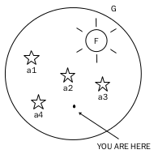
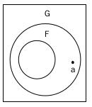
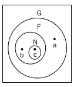
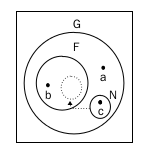

本周分享会
=====

# 本周分享会

=====

## Function & Object

### Function

- 函数声明与函数表达式的区别
- Build-in Functions
- Anonymous functions
- Self-invoking Functions
- Private Function
- function that return a function
- Closures

****

### Object

- 构造函数
- constructor
- instanceof
- hasOwnProperty()
- 对象的创建
- 继承与原型链(prototype)

=====

## 函数声明与函数表达式的区别

- 前者在所有被执行前运行．

- 而函数表达式仅当解释器到达代码的时候才运行

> example 1

    test( 1, 2 );   // 3
    function test( a, b ) {
        return a + b;
    }

> example 2

    test( 1, 2 );   // error: test is undefined
    var test = function( a, b ) {
        return a + b;
    }

=====

## Build-in functions

- parseInt( arg1, arg2 );   // arg2 is 8/16/10

> example

    parseInt('123abc');   // 123
    parseInt('ss'); // NaN

- parseFloat( arg );    

> example

    parseFloat('1.23sss');  // 1.23
    parseFloat(1e+45);  //

- isNaN();  // 是否能用于计算

- isFinite();   // 是否无穷大

> js中的最大值：1.79e+308

=====

## Anonymous functions

### 常见的用途：

- Callbacks

=====

## Self-invoking Functions

### 用法

- ( )( );

### 特点

- 立即执行

- 只执行一次

- 当然也可以执行多次, 如和`arguments.callee`一起使用.

> example

=====

## Private function

### 函数里面的函数

    function f1() {
        function f2() {
            // doSomething
        }
    }

> f2()是f1()的私有函数, 只能被f1访问到. 将在闭包内容里面详解.

=====

## function that return a function

- One performance of closures

- used to rewrite function as soon as execution once

> example

    var a = function() {
        function f1() {
            return "1";
        }
        function f2() {
            return "2";
        }
        f1();
        return f2;
    }

    // 猜下面的运行结果
    a( );
    a( )( );
    
=====

## Closures

- 什么是闭包?

- 你可以把闭包理解成一种途径--修改或者读取一个函数内部的局部变量.

****

### 将从以下几个概念进行讲解

- Scope chain

- Lexical scope

- use Closures

=====

## Scope chain

There is **function scope** in JavaScript, A variable defined in a function is not
visiable outside the function, but a variable defined in a code block(an `if` or
`for` loops)is visiable outside the block. 

> example

=====

## Lexical Scope

In javascript, functions have **lexical scope**. This means that functions create
their environment(scope) when they are defined, not when they are executed.

> 和前面的函数声明和函数表达式相对应

=====

## Closures

先来理解下面这几幅图:

=====

## Closures #1

- return a function

> example

    function f() {
        var b = "b";

        return function() {
            return b;
        }
    }

    // test
    b;  // b is not defined
    var n = f();
    n();    // "b"

=====

## Closures #2

- 忽略关键字var

> example

    var n;
    function f() {
        var b = "b";

        n = function() {
            return b;
        }
    }

    // test
    f();
    n();    // "b"

=====

## 循环结构中的闭包

有如下的代码.

    // html
    <input type="button" value="0">
    <input type="button" value="1">
    <input type="button" value="2">
    <input type="button" value="3">
    <input type="button" value="4">

    // js
    var inputs = document.querySelectorAll('input'),
        len = inputs.length,
        i = 0;

    for ( ; i < len; ) {
        inputs[i].onclick = function() {
            console.log(i);
        }
        i += 1;
    }

=====

## 数组的迭代

考虑如下的代码

    function forEach( arr ) {
        var i = 0;
        return fucntion() {
            return arr[i++];
        }
    }

    // test
    var next = forEach(['a', 'b', 'c']);
    next(); // "a"
    next(); // "b"
    next(); // "c"
    next(); // undefined

> 总结

=====

## arguments

用于函数中, 获取传递给当前函数的参数列表

    function test( a, b ) {
        console.log(a);
        console.log(arguments[0]);
        console.log(b);
        console.log(arguments[1]);
    }

    test(1, 2); // 1 1 2 2 

> 注意: 函数中的形参直接指向arguments的对应项. 非引用!

    function test( a, b ) {
        a = 8;
        console.log(arguments[0]);
    }

    test(1, 2); // 8

> 和后面对象的复制有区别

=====

## arguments.callee

字面的意思就是返回当前参数的函数体. 可以通过它对匿名函数进行循环调用(非匿名函数
可通过名字进行递归调用).

    // 直观理解
    function f() {
        return arguments.callee;
    }

    f();    // function f(){return arguments.callee;}

高级应用.

    (function( count ) {
        if ( count < 5 ) {
            console.log( count );
            arguments.callee( ++count );
        }
    })(1);

=====

## 函数的name属性

- 对应匿名函数, 和函数表达式返回空串

- 对于函数声明则返回真是的函数名

> example

    (function() {console.log(22)};).name;   // ""

    function test() { console.log(22); }
    test.name;  // "test"

=====

## this讲解

其实记住以下几种情景, this很简单.

- 纯粹函数调用时, this指向window

- 作为对象的方法调用时, this就指向上级对象.如jquery对象的某个方法中的this.

- 当作为构造函数调用时, this就指向新生成的对象

- apply & call的调用: 改变函数的调用对象, 第一个参数省略则默认window

> example

    (function(){ alert(this); }).call("hello world");

=====

## 彻底理解this #1

先看第一个例子:

    var name = "The Window";
    var object = {
        name : "My Object",

        getNameFunc : function(){
            return function(){
                return this.name;
            };
        }
    };

    alert(object.getNameFunc()());

=====

## 彻底理解this #2

然后对刚才的例子做如下改动:

    var object = {
        name : "My Object",

        getNameFunc : function(){
            _this = this;
            return function(){
                return _this.name;
            };
        }
    };

    alert(object.getNameFunc()());

=====

#END
